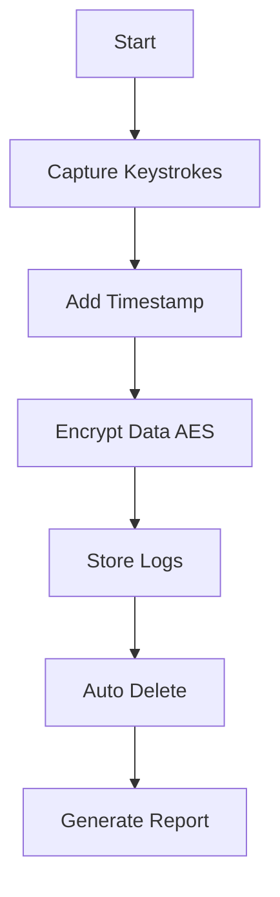
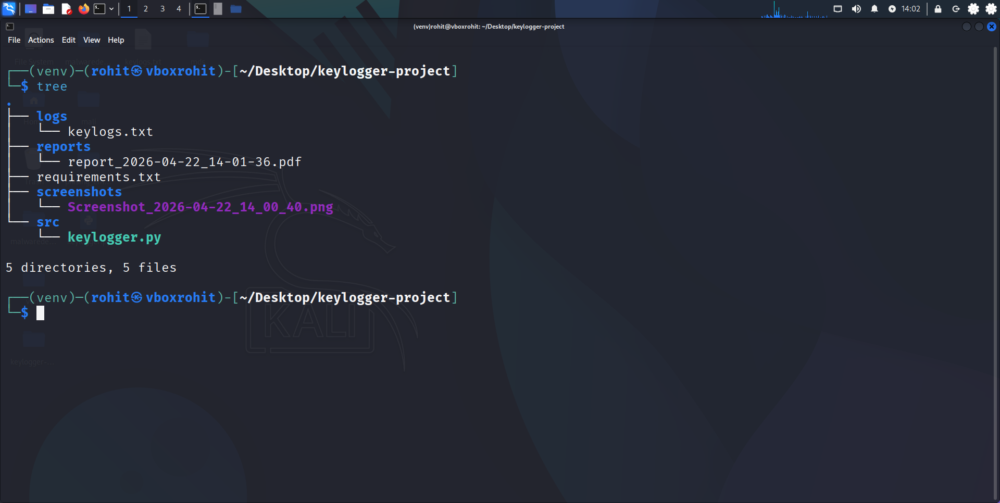

# 🔐 Keylogger (Cybersecurity Project)

<p align="center">
  
  
  
  
</p>

<p align="center">
  <b>Secure • Ethical • Educational Cybersecurity Project</b>
</p>

---

## 🚀 Overview

A **Python-based Keylogger** developed as part of B.Tech Industrial Training at **Ardent Computech Pvt. Ltd.**
This project demonstrates **secure keystroke logging with encryption, ethical compliance, and system monitoring techniques**.

---

## 📌 Introduction

A keylogger records user keystrokes. While useful for **security research, parental control, and system auditing**, it can also be misused.

👉 This project focuses on **ethical, secure, and controlled implementation**.

---

## 🎯 Objectives

* Lightweight Linux keylogger
* Secure keystroke storage
* AES encryption implementation
* Report generation
* Ethical & legal compliance
* Privacy protection with auto-deletion

---

## 🛠️ Tech Stack

| Category  | Tools                |
| --------- | -------------------- |
| Language  | Python               |
| Libraries | pynput, cryptography |
| System    | Linux                |

---

## ⚙️ Workflow



---

## 🔐 Security Features

* 🔒 AES encrypted logs
* 🔑 Session-based key generation
* 🕵️ Hidden storage
* ⏳ Auto deletion
* 🔐 Access control

---

## 📊 Performance

| Metric    | Value  |
| --------- | ------ |
| CPU Usage | < 3%   |
| Memory    | < 50MB |
| Delay     | < 10ms |

---

## 📂 Project Structure

```
keylogger/
├── src/
├── screenshots/
├── reports/
├── docs/
├── requirements.txt
├── README.md
└── .gitignore
```

---

## 🚀 Installation

```bash
git clone https://github.com/rohitmaji22/keylogger.git
cd keylogger
pip install -r requirements.txt
python src/keylogger.py
```

---

## 📸 Screenshots

<p align="center">
  
</p>

---

## ⚠️ Security & Ethics

* Use only with **user consent**
* Unauthorized use is illegal
* Complies with IT Act & GDPR

---

## 🔮 Future Scope

* 🌐 Web dashboard
* 📧 Email alerts
* 📊 Visualization
* 🤖 ML-based detection

---

## ⚠️ Disclaimer

This project is strictly for **educational purposes only**.

> Misuse may lead to legal consequences.

---

## 👨‍💻 Author

**Rohit Maji**
Cybersecurity Enthusiast

---

## ⭐ Support

Give a ⭐ if you like this project!
