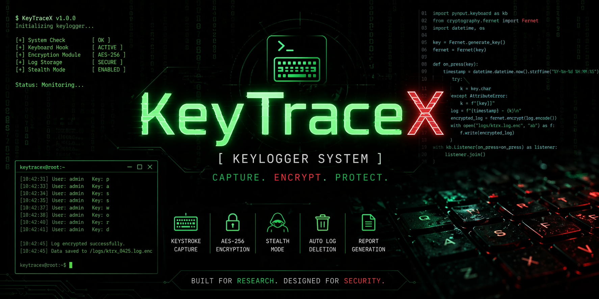
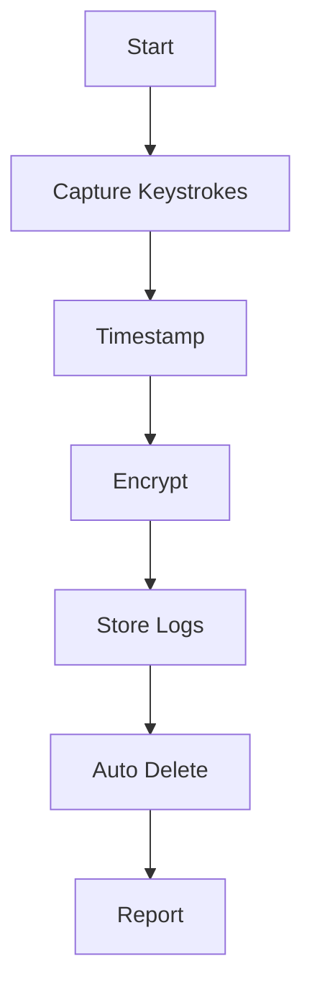

<p align="center">
  
</p>

# 🔐 KeyTraceX – Encrypted Keylogger System

<p align="center">
  <b>Secure • Ethical • Lightweight Cybersecurity Project</b>
</p>

<p align="center">
  
  
  
  
</p>

---

## 🚀 Overview

**KeyTraceX** is a Python-based keylogging system designed for **cybersecurity research and ethical monitoring**.
It focuses on **secure keystroke capture, AES encryption, and privacy-aware data handling**.

---

## ✨ Features

* 🔑 Real-time keystroke capture
* 🔒 AES-256 encrypted logs
* 🧠 Session-based key generation
* ⏳ Automatic log deletion
* 📄 Report generation
* ⚡ Lightweight performance

---

## ⚙️ Workflow



---

## 🔐 Security Architecture

* AES-256 encryption using `cryptography`
* Session keys (not stored)
* Secure file handling
* Auto log cleanup

---

## 📂 Project Structure

```
KeyTraceX/
├── src/
├── logs/
├── reports/
├── screenshots/
├── docs/
├── banner.png
├── README.md
└── requirements.txt
```

---

## 🚀 Installation

```bash
git clone https://github.com/rohitmaji22/KeyTraceX.git
cd KeyTraceX
pip install -r requirements.txt
python src/keylogger.py
```

---

## ⚖️ Legal & Ethical Use

* ✔ Educational use
* ✔ Authorized monitoring
* ❌ Unauthorized use is illegal

---

## 👨‍💻 Author

**Rohit Maji**
Cybersecurity Enthusiast

---

## ⭐ Support

Give a ⭐ if you like this project!
