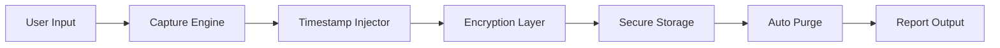

# ⚡ KeyTraceX

<p align="center">     </p> <p align="center"> <b>Secure • Ethical • Educational Cybersecurity Project</b> </p>
---

## 🧠 About the Project

**KeyTraceX** is a stealth-oriented keystroke monitoring system built for **cybersecurity research and ethical system auditing**.

It simulates real-world monitoring scenarios while maintaining **strict encryption, controlled execution, and privacy safeguards**.

---

## 🕶️ Core Capabilities

```
[+] Real-time Keystroke Capture
[+] AES-256 Encryption Engine
[+] Ephemeral Session Keys
[+] Auto Log Destruction
[+] Report Generation System
[+] Low Resource Footprint
```

---

## ⚙️ System Flow



---

## 🔐 Encryption Layer

* AES-256 encryption using Python cryptography module
* Keys generated per session (never stored)
* Secure handling of sensitive keystroke data

---

## 📁 Directory Structure

```
KeyTraceX/
├── src/            # Core engine
├── logs/           # Encrypted keystrokes
├── reports/        # Generated reports
├── docs/           # Documentation
├── screenshots/    # Visuals
└── requirements.txt
```

---

## 🚀 Deployment

```bash
git clone https://github.com/rohitmaji22/KeyTraceX.git
cd KeyTraceX
pip install -r requirements.txt
python src/keylogger.py
```

---

## 📊 Performance Metrics

| Parameter | Value  |
| --------- | ------ |
| CPU Usage | < 3%   |
| Memory    | < 50MB |
| Latency   | < 10ms |

---

## ⚠️ Ethical Protocol

```
> Access without consent = ILLEGAL
> Monitoring without authorization = VIOLATION
> Use responsibly
```

✔ Educational
✔ Authorized Testing
✔ Research Use

---

## 🧬 Future Enhancements

* Web-based monitoring dashboard
* Real-time alert system
* Data visualization module
* AI-based anomaly detection

---

## 👨‍💻 Author

**Rohit Maji**
Cybersecurity | Ethical Hacking | Python

---

## ⭐ Signal Boost

If this project helped or inspired you:

```
[ ★ STAR THE REPO ]
```

---

<p align="center">
  <i>"In cybersecurity, silence is power."</i>
</p>
